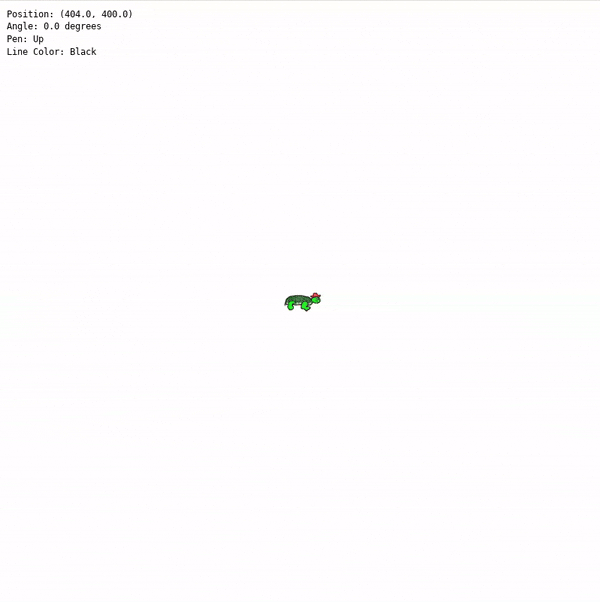

# Interactive Turtle Graphics Program
## Table of Contents
- Introduction
- Features
- Demo
- Installation
  - Prerequisites
  - Building the Project
- Usage
  - Running the Application
  - Controls
- Project Structure
- Dependencies
- Screenshots
- Future Improvements
- Contributing
- License
- Acknowledgements

## Introduction

The Interactive Turtle Graphics Program is a C-based application that emulates the classic turtle graphics concept. Inspired by the Logo programming language, this program allows users to control a sprite (the "turtle") on a 2D canvas through keyboard inputs. As the turtle moves, it can draw lines, enabling users to create intricate patterns and designs interactively.

This project utilizes SDL2 for window management and event handling, and OpenGL for rendering graphics. It serves as a practical application of graphics programming concepts, including transformations, orthographic projection, and real-time rendering.

## Features

- Interactive Control: Move and rotate the turtle sprite using keyboard inputs.
- Dynamic Rendering: Smooth movement and rotation with continuous updates and delta time calculations.
- Line Drawing: Toggle the pen state to draw lines as the turtle moves.
- Customizable Line Colors: Change the color of the lines drawn during runtime.
- Real-time Status Display: View the turtle's position, angle, pen state, and current line color within the application window.
- Window Resizing: Supports dynamic adjustments to the viewport and projection when the window is resized.
- Custom Sprite: Use a personalized image as the turtle sprite, enhancing the visual appeal.

## Demo


## Installation
### Prerequisites

Before building the project, ensure that you have the following libraries and tools installed on your system:

- GCC
- CMake (version 3.10 or higher)
- SDL2
- SDL2_image
- SDL2_ttf
- OpenGL
- GLU

### Building the Project

- Clone the Repository:
```sh
  git clone https://github.com/yourusername/turtle-graphics.git
```
- Navigate to the Project Directory:
```sh
  cd turtle-graphics
```
- Build the Project Using CMake: Create a build directory and run CMake to configure the project:
```sh 
  mkdir build
  cd build
  cmake ..
```
- After configuring the project with CMake, use the follow command ot build it:
```shell
  cmake --build .
```
This will compile the project, and the resulting binary will be placed in the Binaries/ directory.

## Usage
### Running the Application

Execute the binary from the Binaries/ directory:
```sh
  ./Binaries/turtle
```
Alternatively, you can run it from the project root:
```sh
  ./Binaries/turtle
```

### Controls

    Movement:
        Up Arrow (↑): Move forward in the direction the turtle is facing.
        Left Arrow (←): Rotate the turtle left (counterclockwise).
        Right Arrow (→): Rotate the turtle right (clockwise).

    Pen Controls:
        D Key: Pen down (start drawing).
        U Key: Pen up (stop drawing).

    Color Selection:
        1 Key: Set line color to Black.
        2 Key: Set line color to Blue.
        3 Key: Set line color to Red.
        4 Key: Set line color to Green.
        5 Key: Set line color to Yellow.

    Exit:
        ESC Key: Exit the application.

## Project Structure
```plaintext
turtle-graphics/
├── Include/
│   ├── events.h
│   ├── graphics.h
│   ├── sprite.h
│   ├── text.h
│   └── utilities.h
├── Src/
│   ├── events.c
│   ├── graphics.c
│   ├── main.c
│   ├── sprite.c
│   ├── text.c
│   └── utilities.c
├── Images/
│   └── mateo.png
├── Fonts/
│   └── DejaVuSansMNerdFont-Regular.ttf
├── Binaries/
│   └── turtle
├── Obj/
│   └── [Compiled object files]
├── CMakeLists.txt
├── LICENSE
└── README.md
```
- Include/: Contains header files for the project modules.
- Src/: Contains the source code files.
- Images/: Contains the sprite image(s).
- Fonts/: Contains font files used for text rendering.
- Binaries/: Contains the compiled binary executable.
- Obj/: Contains compiled object files.
- Makefile: Build instructions for compiling the project.

## Dependencies

The project depends on the following libraries:

- SDL2: Simple DirectMedia Layer 2.0
- SDL2_image: Image loading library for SDL2
- SDL2_ttf: TrueType font rendering library for SDL2
- OpenGL: Open Graphics Library for rendering graphics
- GLU: OpenGL Utility Library

Ensure that these libraries are installed on your system before building the project.

### Installing dependencies for Linux users
The easiest way to install these dependencies is by using your package manager. Below are installation commands for common linux distributions.

<b>For Ubuntu/Debian-based Systems:</b>
```shell
  sudo apt update
  sudo apt install cmake g++ libsdl2-dev libsdl2-image-dev libsdl2-ttf-dev libgl1-mesa-dev libglu1-mesa-dev
```

<b>For Fedora-based Systems:</b>
```shell
sudo dnf install cmake gcc-c++ SDL2-devel SDL2_image-devel SDL2_ttf-devel mesa-libGL-devel mesa-libGLU-devel
```

<b>For Arch-based systems:</b>
```shell
sudo pacman -S cmake gcc sdl2 sdl2_image sdl2_ttf mesa glu
```

### For other Linux distributions

If you are using another Linux distribution, use your package manager to install the following packages:
- `cmake`
- `gcc` (or another C compiler)
- `libsdl2-dev`
- `libsdl2-image-dev`
- `libsdl2-ttf-dev`
- `libgl1-mesa-dev` (for OpenGL)
- `libglu1-mesa-dev` (for GLU)

You can typically find these libraries in your package manager’s repositories. If not, you may need to manually download and install them from their respective websites.

## Screenshots

1. Application Launch

Caption: The application window upon launch, displaying the turtle sprite centered on the canvas.

2. Drawing Lines

Caption: The turtle moving with the pen down, drawing lines on the canvas.

3. Changing Colors

Caption: Lines drawn in different colors as the user changes the line color using number keys.

4. Sprite Rotation

Caption: The turtle sprite rotated at an angle, demonstrating smooth transformations.

5. Real-time Status Display

Caption: Real-time status information displayed within the application window.

Note: Replace the placeholders with actual screenshots from your application. Save the images in a screenshots/ directory within your repository.

## Future Improvements

- Enhanced Drawing Capabilities: Implement additional shapes and patterns.
- User Interface Enhancements: Develop a GUI for easier control and color selection.
- Saving and Loading Drawings: Allow users to save their creations and load them later.
- Scripting Support: Enable users to input sequences of commands to automate drawing.
- Performance Optimization: Transition to modern OpenGL practices for better performance.

## Contributing

Contributions are welcome! If you'd like to contribute to this project, please follow these steps:

- Fork the Repository
```sh
git fork https://github.com/yourusername/turtle-graphics.git
```
- Create a Feature Branch
```sh
git checkout -b feature/your-feature-name
```
- Commit Your Changes
```sh
git commit -am 'Add some feature'
```
- Push to the Branch
```sh
    git push origin feature/your-feature-name
```
- Open a Pull Request

## **License**

This project is licensed under the **GNU General Public License v3.0** - see the [LICENSE](LICENSE) file for details.

## Acknowledgements
- SDL2: https://www.libsdl.org/
- OpenGL: https://www.opengl.org/
- GLU: OpenGL Utility Library
- SDL_ttf: https://www.libsdl.org/projects/SDL_ttf/
- SDL_image: https://www.libsdl.org/projects/SDL_image/
- Font: DejaVu Sans Mono Nerd Font - Nerd Fonts

## Contact
- Author: MattyICE
- Email: matty_ice_2011@pm.me
